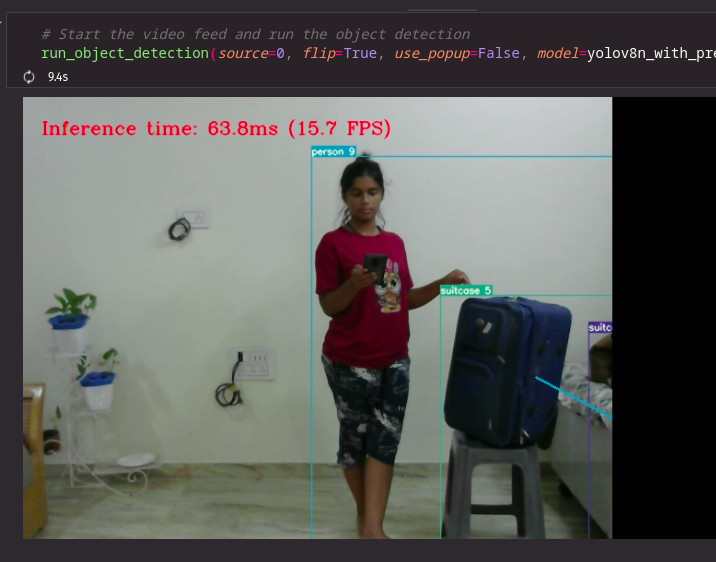
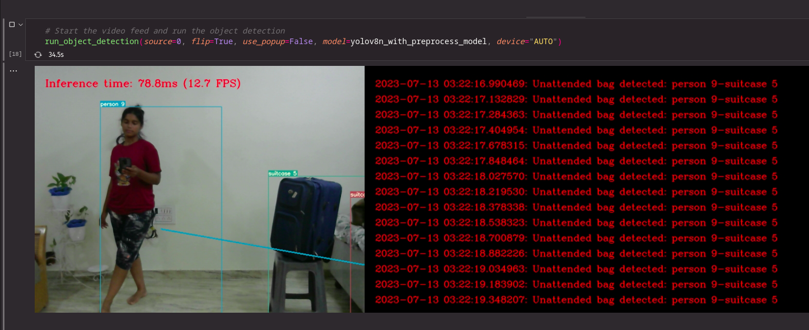
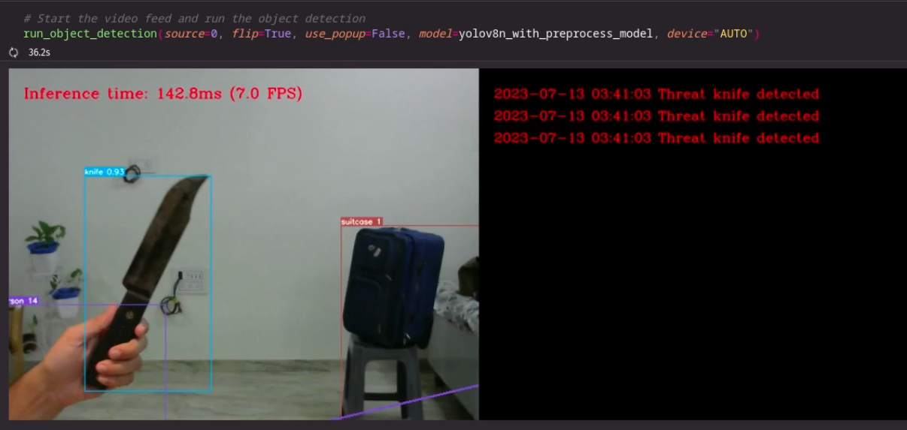
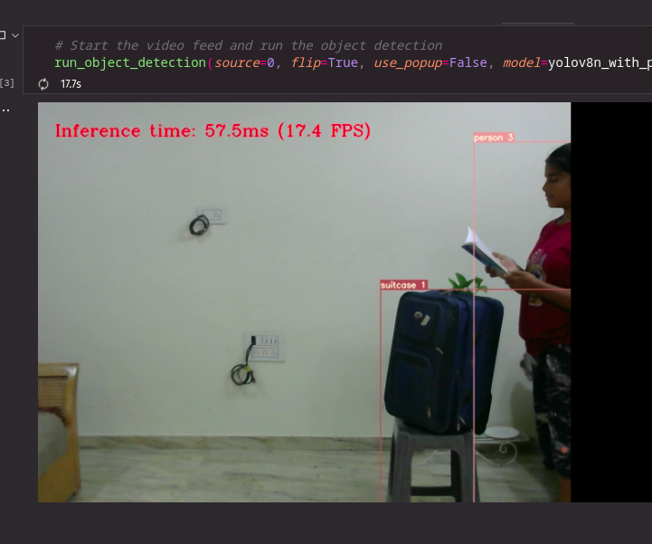
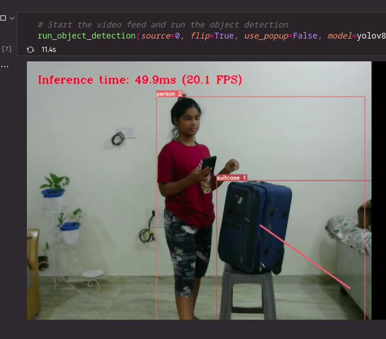
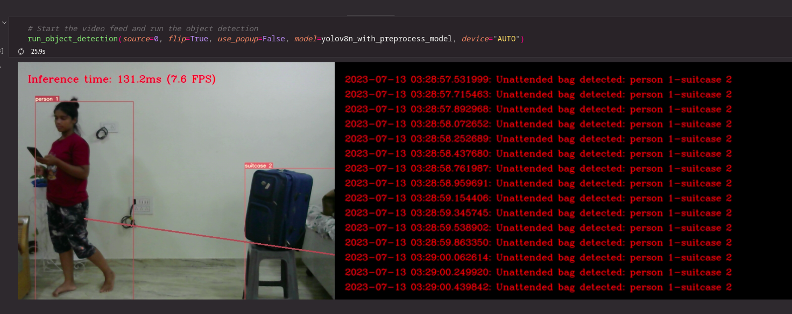

# Threat Detection and Unattended Baggage Detection with Associated Person Tracking
__YOLOv8s + OpenVINO + DeepSORT__: A demo of threat detection and unattended baggage tracking. 

A [YOLOv8s](https://docs.ultralytics.com/tasks/detect/) is trained on [COCO](https://cocodataset.org) dataset and the weights are converted to OpenVINO format. The model is then used to detect threats and unattended baggage in a video stream. The detections are then tracked using DeepSORT.

## Features
- **Threat Detection**: Identifies potential threats such as `knife` and `scissor` classes.
- **Multiple Tracking**: Utilizes DeepSORT for tracking multiple persons and their associated baggages.
- **Unattended Baggage Detection & Alerting**: Flags and alerts when a person moves away from their associated baggage beyond a set threshold distance and time.
- **Alert Resolution**: Recognizes when an unattended baggage is claimed back by the associated person within a certain "grace period", and accordingly resolves the alert.
- **Grace Period Exceeded Alert**: Issues an additional alert when an unattended baggage remains unclaimed beyond the grace period.
- **Leaving Scene Management**: Handles situations where a person leaves the scene entirely, tracking and alerting on their unattended baggage.
- **Historical Baggage Monitoring**: Keeps an eye on baggages left unattended in the frame for more than a set duration, even without an associated person present.
- **Prevents Repeated Alerts**: Suppresses repeated alerts for the same unattended baggage until resolved, avoiding alert spam.

__Please note: The system's accuracy and effectiveness depend on the quality of the object detection model, the configuration of thresholds and durations, and the clarity of the video feed.__

## Current limitations in this demo:
- The bounding box logic isn't perfect and sometimes the bounding boxes just go outside the frame. This can cause the centre points to be outside the frame and tracking to fail.
- The model is limited by its training data (COCO dataset). It doesn't detect some classes (e.g., gun) because they weren't in the training data.
- We are using the 's' version of YOLOv8 due to issues maintaining consistency across frames. While the 'n' version is faster, it may not be as accurate.

## How can it be improved:
- Train the model on a custom dataset with specific classes we want to detect (e.g., person, knife, scissor, luggage, backpack, handbag, gun).
- Reuse the 'n' version of YOLOv8 and fix the consistency issue.
- Improve the bounding box logic to keep boxes inside the frame.
- Find a way for DeepSORT to deal with custom aspect ratios and sizes to deal with multi classes. (Use separate models for each class or use find a new technique altogether.)
- Since the model used for DeepSORT called `mars-small128` is a TensorFlow model, we can convert it to OpenVINO IR format, add the preprocessing into the model and then also re-engineer or update the functions `extract_image_patch`, `create_box_encoder`, `ImageEncoderTF` and `_run_in_batches` in `utils.py` to be OpenVINO optimised using the latest updated libraries/helpers.
  
Since the complexity of testing the whole implementation, I won't be able to patch all issues before the [Intel Chips' CHallenge - Detect Faster](https://events.hackster.io/chips-challenge/) deadline.

## How it works
1. The model is trained on COCO dataset using YOLOv8s. (We used the `s` instead of `n` because we were having trouble with keeping consistency across the frames)
2. The model is then converted to OpenVINO format using the `convert.ipynb` notebook.
3. The model is then used to detect threats and unattended baggage in a video stream:
    - Filter detections to only show the threats and persons and unattended baggage.
    - Create unique detections for each person and unattended baggage using __DeepSORT__.
    - Then create pairs for them, while also returning the alerts for threats.
    - Create a relationship between the unattended baggage and the closest person to track the unattended baggage.
    - Finally, draw the detections, keep track of the time period of the unattended baggage and draw the alerts.
  
## File Structure
1. `demo.ipynb` is the main file that runs the inference, you have specified the video source and OpenVINO optimised model path. You may also play with the DeepSORT and Threat alert configuration in there.
2. `convert.ipynb` is copied straight from [YOLOv8-OpenVINO-Optimised](https://github.com/AJV009/YOLOv8-OpenVINO-Optimised) used purely to optimise the YOLO model using OpenVINO Toolkit.
3. `utils.py` contains a ton of helper functions and methods used for post-processing on the image. To be specific:
    - `log_output` Outputs logging stuff to log.txt
    - `VideoPlayer` class handles the counting of fps and management of frames (Copied from [OpenVINO Notebooks - YOLO optimization](https://github.com/openvinotoolkit/openvino_notebooks/blob/main/notebooks/230-yolov8-optimization/230-yolov8-optimization.ipynb))
    - `plot_one_box` plots a single box in the given frame (Copied from [OpenVINO Notebooks - YOLO optimization](https://github.com/openvinotoolkit/openvino_notebooks/blob/main/notebooks/230-yolov8-optimization/230-yolov8-optimization.ipynb))
    - `letterbox` resizes the image to fit into a new shape by saving the original aspect ratio and pads it to meet stride-multiple constraints (Copied from [OpenVINO Notebooks - YOLO optimization](https://github.com/openvinotoolkit/openvino_notebooks/blob/main/notebooks/230-yolov8-optimization/230-yolov8-optimization.ipynb))
    - `postprocess` applies non maximum suppression algorithm to detections and rescale boxes to their original image size (Copied from [OpenVINO Notebooks - YOLO optimization](https://github.com/openvinotoolkit/openvino_notebooks/blob/main/notebooks/230-yolov8-optimization/230-yolov8-optimization.ipynb))
    - `process_results` manages the filtering and DeepSORT tracking for the objects.
    - `track_risk` manages the alerts and tracking of object pairs

## How to run
1. Install the requirements:
    ```bash
    pip install -r requirements.txt
    ```
2. Create the optimized model by running the notebook cells at `convert.ipynb` to convert the model to OpenVINO format. **(IMPORTANT)**
2. Run the cell at `demo.ipynb` to run the demo. _(Make sure to change the video path to your supported video source)_
    
_Note: Demo won't work without creating the optimized model._

## Huge thanks to:
- To my sister for staying up late with me to test the demo and debug the detections. :heart:
- DeepSORT library: [theAIGuysCode/yolov4-deepsort](https://github.com/theAIGuysCode/yolov4-deepsort)
- The binding logic for DeepSORT and YOLO: [MatPiech/DeepSORT-YOLOv4-TensorRT-OpenVINO](https://github.com/MatPiech/DeepSORT-YOLOv4-TensorRT-OpenVINO)
- Used as a base repo for inference: [AJV009/YOLOv8-OpenVINO-Optimised](https://github.com/AJV009/YOLOv8-OpenVINO-Optimised)

## Demo (CPU)

__Unattended Baggage Detection:__



__Thread Detection:__


__More Demos:__



